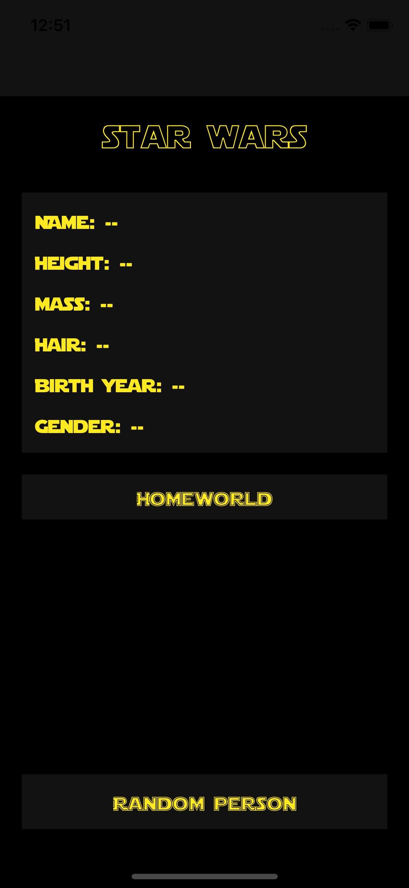
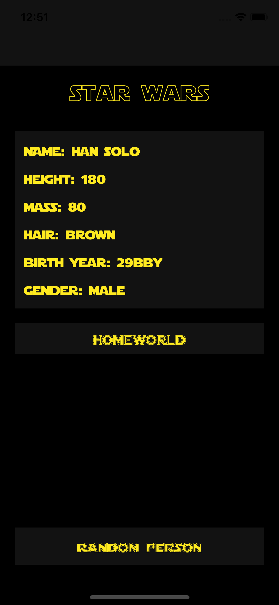
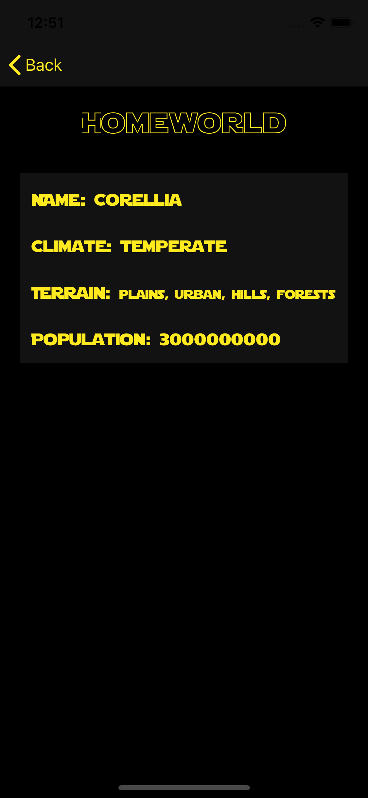

# StarWarsPocketbook
An iOS Application that stores all of the information for the people from the Star Wars Universe

# What I Learned

- Download & Parse JSON data
- Using CocoaPods, AlamoFire & SwiftyJSON alongside StarWars API (swapi.co)
- Update UI with API data

# Screenshots

   

